# Projeto: Análise de Bullying Escolar com Base nos Dados de 2018

Este repositório apresenta um projeto de análise de dados para explorar e modelar informações relacionadas ao bullying escolar com base no dataset **Bullying\_2018.csv**. O projeto foi estruturado seguindo a metodologia **CRISP-DM** (Cross-Industry Standard Process for Data Mining), garantindo uma abordagem sistemática e replicável.

## Estrutura do Repositório

- **Documentação**:

  - Aplicação da metodologia **CRISP-DM**, abordando:
    1. **Entendimento do Negócio**: O bullying é uma questão crítica que afeta o bem-estar físico e emocional de jovens no ambiente escolar. Este projeto busca responder às seguintes questões centrais:
      - Quais são os fatores associados ao bullying entre jovens?
         Identificamos padrões socioemocionais, físicos e interpessoais que influenciam a probabilidade de um jovem ser vítima de bullying.
      - Quais características estão mais correlacionadas ao bullying?
         Com base nos dados, destacamos:
             -  Aspectos relacionados ao suporte social (amizades e apoio emocional).
            - Condições de saúde mental, como níveis de ansiedade e depressão.
            - Experiências de violência física ou verbal no ambiente escolar.
      - Como prever a probabilidade de ocorrência de bullying?
         A aplicação de um modelo de Regressão Logística permite prever casos com base em fatores identificados, ajudando na implementação de ações preventivas direcionadas.
    2. **Entendimento dos Dados**: O dataset contém informações relacionadas à experiência de estudantes sobre bullying, incluindo variáveis demográficas, acadêmicas e emocionais.
         - Informações iniciais do conjuntos de dados

         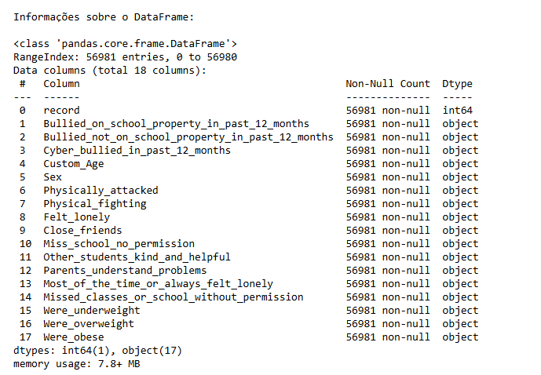

         - Valores ausentes em formato " " (vazio)
            
         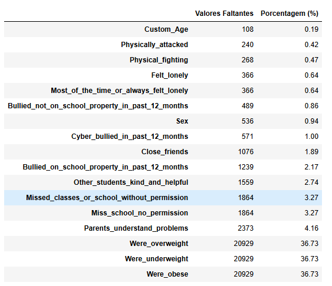

         - Distribuição da Variável Target ('Bullied_on_school_property_in_past_12_months')
          - Considerando valores ausentes (vazios) como 'No_answer'
            
         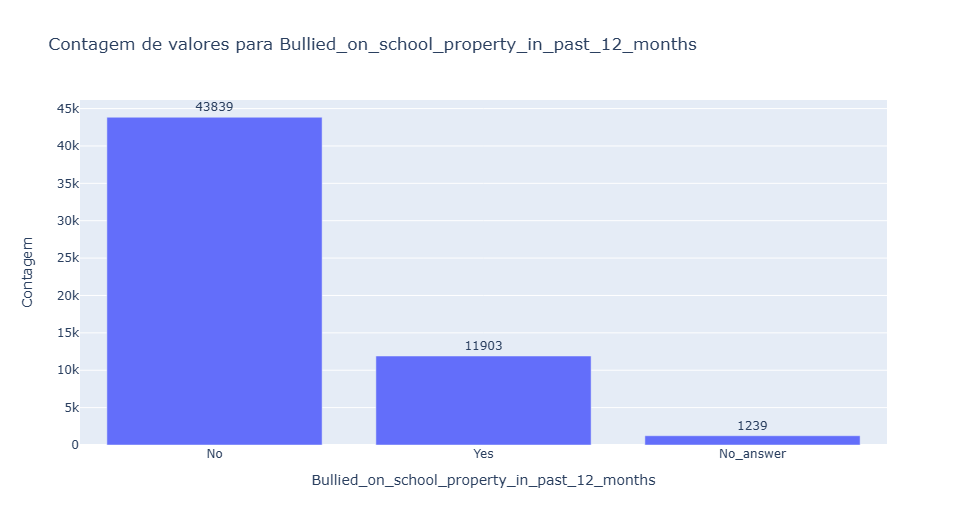

         - Distribuição da Variável Sexo versus a Variável Target
            
         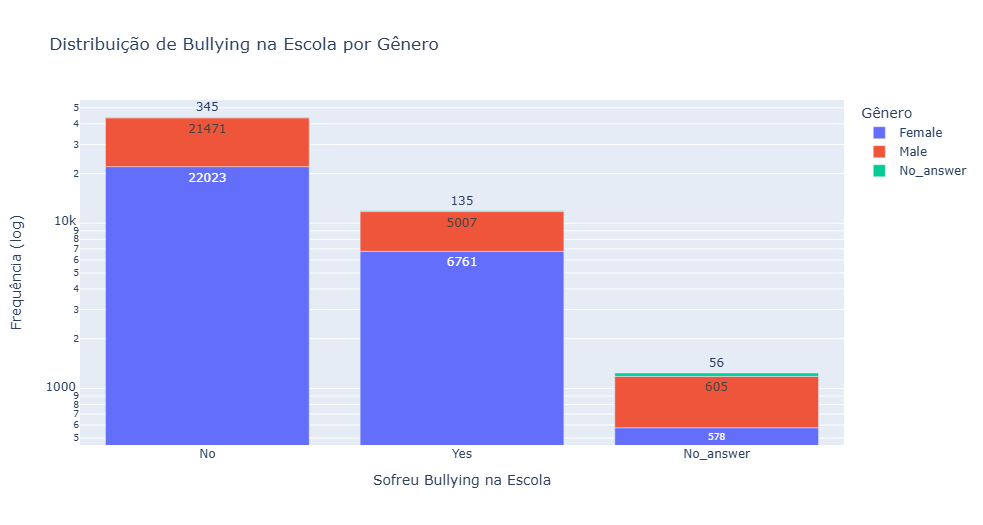

         - Distribuição das idades, por faixas etárias vulneráveis ao bullying
            
         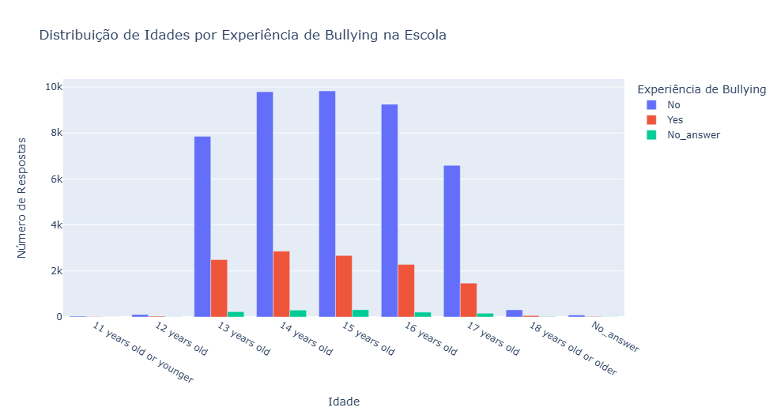

         - Distribuição de gênero
            
         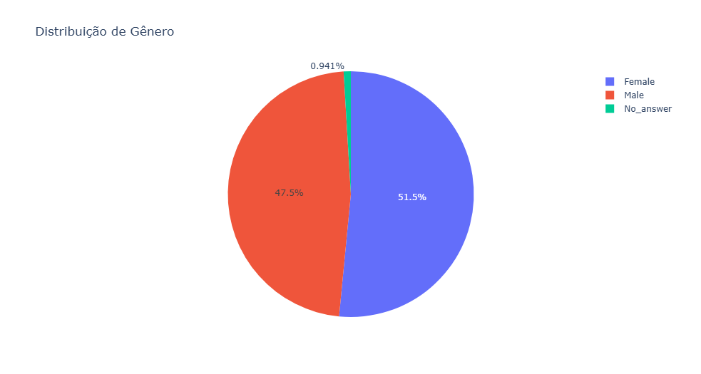

         - Quantidade de alunos que sofreram 1, 2 ou 3 tipos de bullying
            
         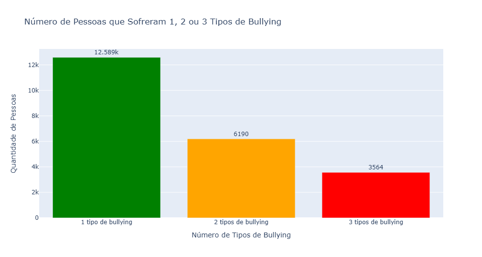

         - Correlações entres as variáveis explicativas e a variável target
            
         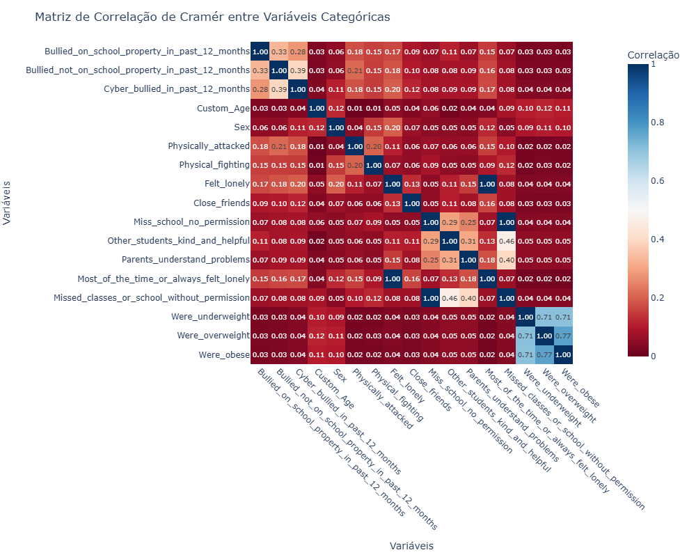     

    3. **Preparação dos Dados**: Garantir a qualidade dos dados e adequá-los para as etapas de análise e modelagem.
         - **Limpeza de dados**:
            - Renomeação de colunas para o formato `snake_case`.
            - Remoção de `record_id` por falta de relevância preditiva.
            - Substituição de valores ausentes:
            - Numéricos (`age`) imputados com a mediana.
            - Categóricos substituídos por `'No_answer'` ou tratados como NaN.
            - Exclusão de linhas nulas na variável-alvo `bullied_at_school`.
         - **Codificação**:
         - One-Hot Encoding para variáveis explicativas.
         - Label Encoding para a variável-alvo.
         - **Multicolinearidade**:
         - Remoção de colunas com alto VIF para melhorar a robustez do modelo.

         - **Tipos de Dados**: Conversão de colunas numéricas para inteiros.

    4. **Análises**: Visualizações e insights iniciais.
      - Proporção de gênero por briga física
            
      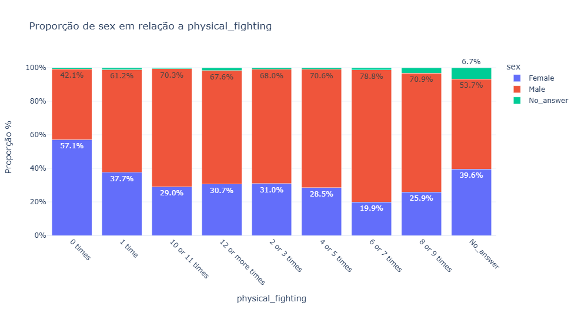

      - Boxplot de bullying dentro da escola
            
      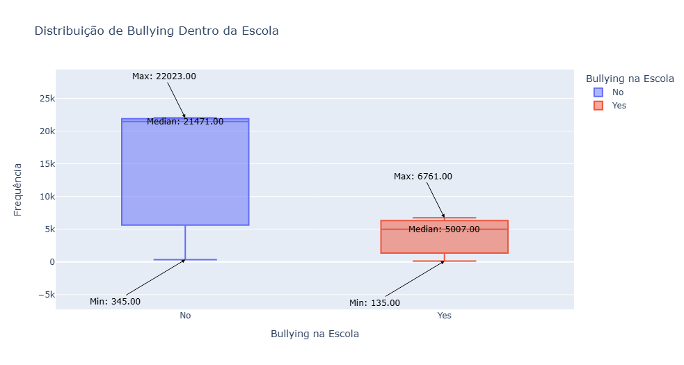 
    
    5. **Modelagem**: Desenvolvimento e avaliação de modelos preditivos.
      - **Regressão Logística**: Modelo estatístico para prever a probabilidade de eventos binários.

         - Pipeline de Modelagem

         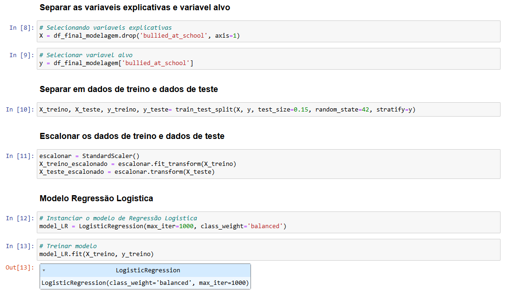

         - GridSearch

         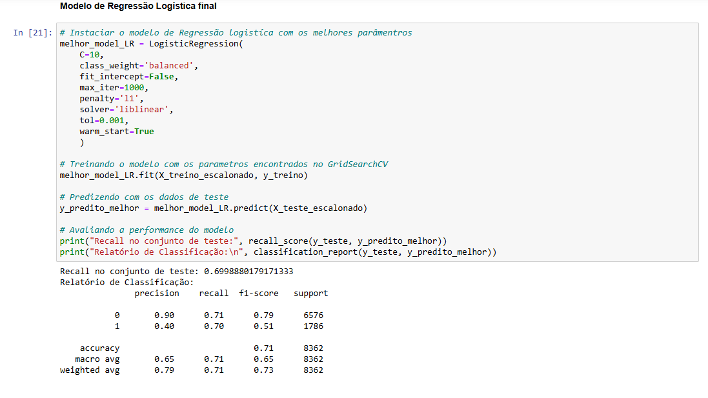

         - Métricas de Desempenho

         | Métrica          | Valor    |
         | ------------------|----------|
         | Acurácia         | 71%      |
         | Recall (Classe 1)| 70%      |
         | Precision (Classe 1)| 40%   |
         | F1-Score (Classe 1)| 0.51   |

         - Matriz de Confusão

         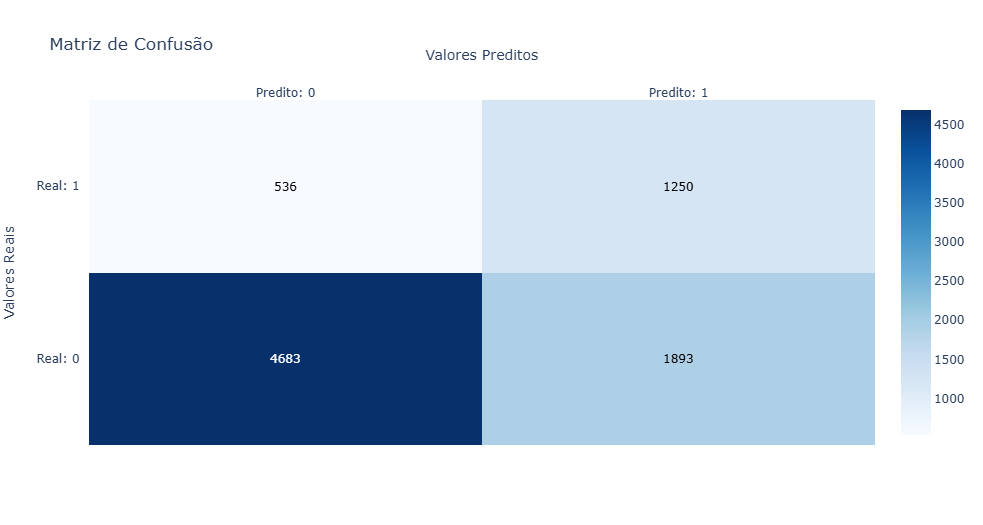

         - Importância das Variáveis (SHAP)

         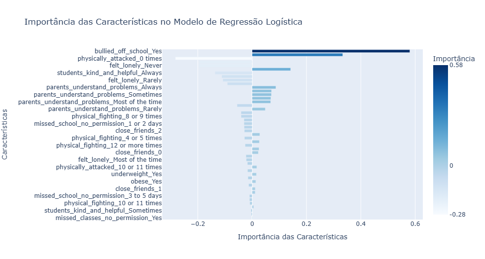


    6. **Avaliação**: O objetivo deste projeto foi classificar estudantes como vítimas de bullying ("Yes") ou não ("No"), e identificar padrões que influenciam essa ocorrência.
      - Análise Exploratória
         - **Perfil dos Estudantes**: Maioria entre 13 e 17 anos, predominantemente do Ensino Médio. 55% meninas, 40% meninos, 5% não-binários.
         - **Fontes de Bullying**: 65% dos casos estão relacionados a conflitos na sala de aula e 45% nas redes sociais.
         - **Fatores de Risco**: Solidão e falta de apoio social aumentam a probabilidade de bullying. Experiências de violência também estão associadas.

      - Avaliação do Modelo
         - **Acurácia**: 70.96%. O modelo tem uma boa performance geral, mas deve ser complementado por outras métricas.
         - **Precisão (Classe 1)**: 39.78%. O modelo tende a gerar falsos positivos, prevendo bullying onde não há.
         - **Recall (Classe 1)**: 69.99%. O modelo é bom em identificar casos reais de bullying, mas ainda perde alguns.
         - **F1-Score (Classe 1)**: 50.73%. Compromisso entre precisão e recall, com margem para melhorias.
         - **Matriz de Confusão**: Exibe os acertos e erros do modelo, com foco em minimizar falsos negativos (bullying não identificado).

      - Limitações Identificadas
         - **Dados Ausentes**: Variáveis como "underweight" e "overweight" têm 36.73% de dados ausentes. Imputação foi usada para 'age' e remoção para a variável alvo "bullied_at_school".
         - **Viés nos Dados**: A amostra pode não representar toda a diversidade estudantil.
         - **Limitações do Modelo**: A regressão logística pode não capturar relações complexas.

      - Validação do Modelo
      - O modelo alinha-se bem ao problema de negócio, identificando fatores de risco para bullying. Ele é interpretável e pode ser integrado facilmente em plataformas educacionais, ajudando profissionais da educação a tomar decisões informadas.


- **Arquivos do Projeto**:

  - `EDA.ipynb`: Análise Exploratória dos Dados (Exploratory Data Analysis).
  - `Wrangling.ipynb`: Limpeza e transformação dos dados.
  - `Model.ipynb`: Construção e avaliação dos modelos de aprendizado de máquina.

- **Dados**:

  - `data/raw`: Contém os dados brutos (“Bullying\_2018.csv”).
  - `data/processed`: Contém os dados processados para análise e modelagem.

- **Dashboard**:

  - Um dashboard interativo para exploração dos resultados.

## Tecnologias e Ferramentas

- **Linguagem**: Python.
- **Bibliotecas Principais**:
  - `pandas`, `numpy`: Manipulação e análise de dados.
  - `matplotlib`, `seaborn`, `plotly`: Visualização de dados.
  - `scikit-learn`: Modelagem preditiva.
  - `shap`: Explicabilidade de modelos.
- **Dashboard**: Desenvolvido com bibliotecas interativas como `Dash` em Python, e dashboard desenvolvido na ferramenta do PowerBI.

## Como Executar

1. Clone o repositório:

   ```bash
   git clone https://github.com/seu_usuario/bullying_2018_analysis.git

2. Instale as dependências:
    ```bash
    !pip install -r requirements.txt

3. Execute os notebooks:

Certifique-se de que os dados estão no diretório correto (data/raw).
Abra os arquivos .ipynb no Jupyter Notebook ou JupyterLab.

4. Visualize o dashboard:

Siga as instruções no diretório dashboard para rodar a aplicação localmente.


## Resultados
- Insights relevantes sobre fatores associados ao bullying.
- Modelo preditivo com explicações visuais (é importante mencionar algum destaque, como interpretabilidade ou impacto das variáveis).
- Visualizações interativas para stakeholders.

## Contribuições
- São bem-vindas sugestões, relatórios de problemas e solicitações de funcionalidades. Para contribuir:

1. Crie um fork do repositório.
2. Implemente as alterações.
3. Envie um pull request.

## Licença
Este projeto está licenciado sob a Licença MIT.

## Autores:
 - Ana Carolina Szczepanski Oliveira
 - Claisa Lubke
 - Elis Regina Weiss
 - Hanna Câmara da Justa
 - Iris Brandao Pires Linhares
 - Isabella Stersa de Oliveira
 - Larissa das Chagas Brum
 -  Lidiane Vicente
